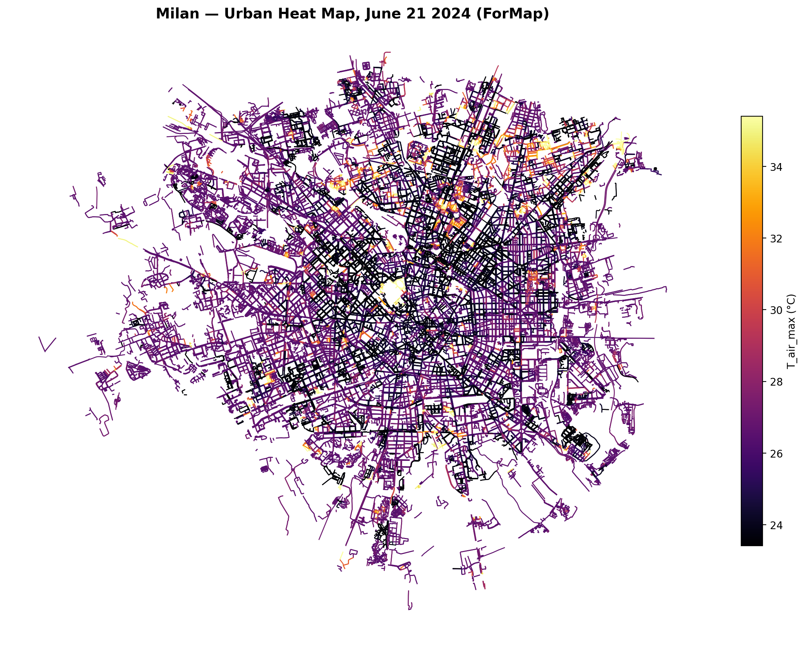
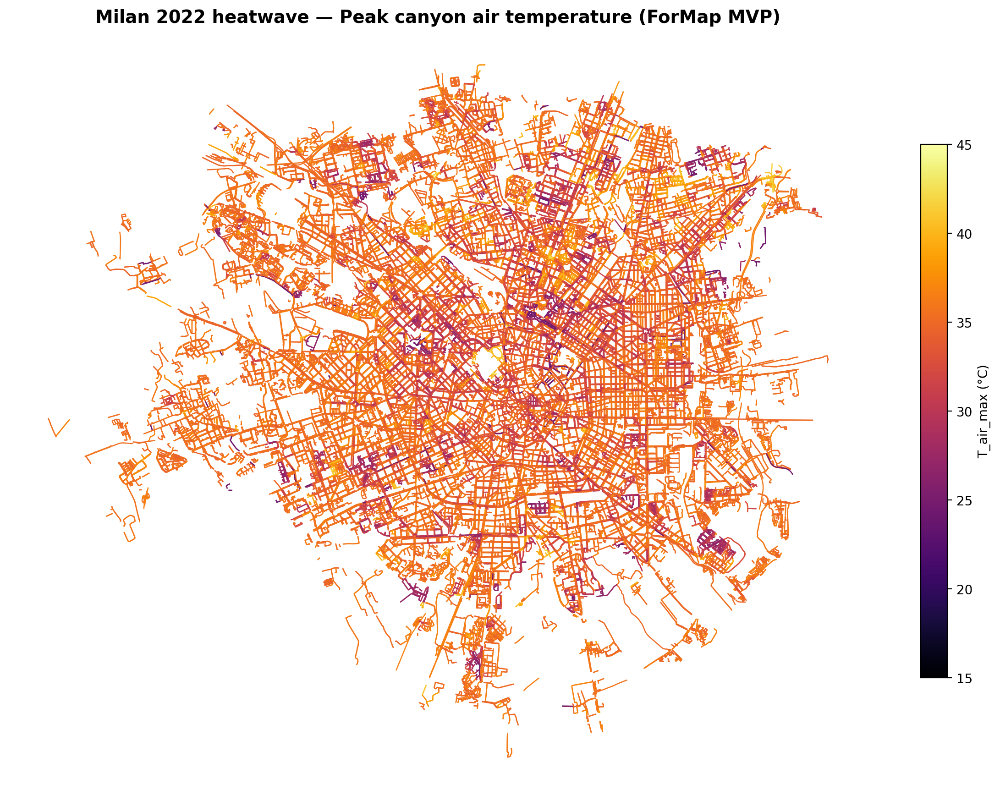

# ForMap — Urban Thermal Simulation

**ForMap** generates thermal maps of entire cities from open-source geospatial data (OpenStreetMap + Copernicus), by simulating radiative and convective heat exchange in urban street canyons.

**244 000 canyons across Milan — simulated in 46 seconds on a single GPU.**

---

## Interactive outputs — full city

| | |
|---|---|
| [🗺 Thermal map](https://federicomattiuz.github.io/ForMap_Results/map_interactive.html) | All 244 k canyons coloured by peak air temperature |
| [⏱ Hourly animation](https://federicomattiuz.github.io/ForMap_Results/temporal_slider.html) | Temperature snapshots across the day |
| [📊 Canyon shading effect](https://federicomattiuz.github.io/ForMap_Results/canyon_effect.html) | Peak temperature vs canyon aspect ratio H/W |
| [📈 ERA5 validation](https://federicomattiuz.github.io/ForMap_Results/era5_comparison.html) | ForMap vs ERA5 observed air temperature, 21 June 2022 |

---

## Climate scenario comparison — Milan, 21 June

| Scenario | T_morning | Mean T_air_max | Canyons > 30 °C |
|---|---|---|---|
| Milan 2024 (recent normal) | 21.3 °C | 30.6 °C | 64.5 % |
| **2022 heatwave overnight** | **24.6 °C** | **33.5 °C** | **91.0 %** |

**+26.5 percentage points more canyons exceed 30 °C** during the heatwave (64.5 % → 91.0 %).

  
  

*Same colour scale on both maps. Purple/violet = cooler streets. Orange/red = hottest.*

---

## Verify the physics

The notebook runs the same physics-based thermal simulation on ~1100 canyons from Milan's Centrale district (~2 min on free Colab CPU). No GPU or private code needed.

---

## What ForMap is for

**ForMap** is the thermal mapping engine of **Forban**, a startup developing novel urban green infrastructure for climate adaptation.

The thermal map is the foundation. Starting from it, ForMap is designed to compute operational parameters for urban green infrastructure — irrigation demand, intervention performance, building thermal loads — giving operators and planners a physics-based baseline instead of rules of thumb.

ForMap answers *where* a city overheats and *why*. The platform it underpins is built to answer *what to do about it* — at city scale, from open data, before anything is built.

---

*Contact: federico.mattiuz00@gmail.com*
